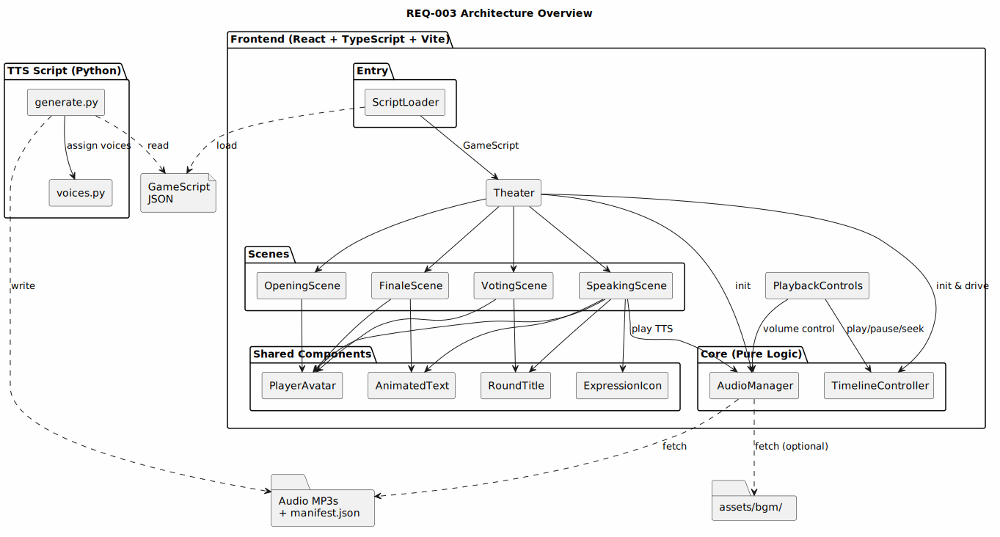
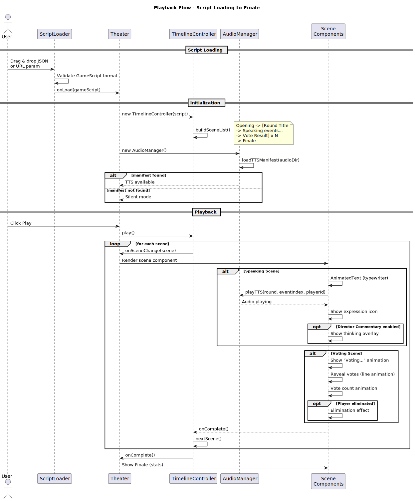

# REQ-003 Technical Design — Web Script Replay

> Status: Technical Finalized
> Requirement: requirement.md
> Created: 2026-03-14
> Updated: 2026-03-14

## 1. Technology Stack

| Module | Technology | Rationale |
|:---|:---|:---|
| TTS Script | Python 3.10+ / edge-tts | 已在 pyproject.toml 的 render 依赖组中；免费、中文多声线 |
| Frontend Framework | React 18 + TypeScript | 需求指定，组件化开发适合场景切换 |
| Styling | Tailwind CSS 3 | 需求指定，快速实现深色主题和动画 |
| Build Tool | Vite 5 | 需求指定，开发体验好，支持纯静态部署 |
| Animation | Framer Motion | React 生态最成熟的动画库，适合入场/淘汰/打字机等效果 |
| Audio Playback | Howler.js | 跨浏览器音频控制，支持多轨同时播放（BGM + TTS） |
| State Management | React Context + useReducer | 轻量级，无需 Redux；全局状态仅播放控制 |

## 2. Design Principles

- High cohesion, low coupling: 每个场景（Scene）为独立组件，通过 Timeline 控制器驱动切换
- Reuse first: PlayerAvatar、AnimatedText 等基础组件在多个场景间复用
- Testability: Timeline 控制器为纯逻辑模块，可独立于 React 测试
- 数据驱动: 所有渲染由 GameScript JSON 驱动，组件不持有业务状态

## 3. Architecture Overview



```
┌─────────────────────────────────────────────────────┐
│                   Frontend (React)                  │
│                                                     │
│  ┌─────────┐   ┌──────────────┐   ┌──────────────┐ │
│  │ Script   │──▶│   Timeline   │──▶│   Scenes     │ │
│  │ Loader   │   │  Controller  │   │ (Opening/    │ │
│  │ (F-07)   │   │  (F-06)      │   │  Speaking/   │ │
│  └─────────┘   └──────┬───────┘   │  Voting/     │ │
│                       │           │  Finale)     │ │
│                       ▼           └──────────────┘ │
│              ┌──────────────┐                      │
│              │ Audio Manager │                      │
│              │ (BGM + TTS)  │                      │
│              └──────────────┘                      │
└─────────────────────────────────────────────────────┘

┌─────────────────────────────────────────────────────┐
│              TTS Script (Python)                    │
│  backend/tts/generate.py                            │
│  GameScript JSON ──▶ MP3 files per speech event     │
└─────────────────────────────────────────────────────┘
```

Source code layout:

```
backend/
  tts/
    __init__.py
    generate.py          # TTS generation entry point
    voices.py            # Voice assignment logic

frontend/
  index.html
  package.json
  vite.config.ts
  tailwind.config.ts
  tsconfig.json
  src/
    main.tsx
    App.tsx
    types/
      game-script.ts     # TypeScript types mirroring GameScript schema
    core/
      timeline.ts        # Timeline controller (pure logic)
      audio-manager.ts   # Audio playback management
    components/
      ScriptLoader.tsx   # F-07: Drag & drop + URL loading
      Theater.tsx        # Main theater container + scene routing
      PlaybackControls.tsx  # F-06: Play/pause/speed/progress
      scenes/
        OpeningScene.tsx    # F-02
        SpeakingScene.tsx   # F-03
        VotingScene.tsx     # F-04
        FinaleScene.tsx     # F-05
      shared/
        PlayerAvatar.tsx    # Reusable avatar (SVG + initials)
        AnimatedText.tsx    # Typewriter effect
        ExpressionIcon.tsx  # Expression emoji/icon
        RoundTitle.tsx      # Round title animation
```

## 4. Module Design

### 4.1 TTS Generation Module (`backend/tts/`)

- **Responsibility:** 将 GameScript JSON 中的发言事件转为 MP3 音频文件
- **Public interface:**
  - CLI: `python -m backend.tts.generate <script_json_path>`
  - Function: `async def generate_audio(script_path: str, output_dir: str | None = None) -> AudioManifest`
- **Internal structure:**
  - `generate.py`: 主入口，解析 JSON，遍历 speaking 事件，调用 edge-tts
  - `voices.py`: 声线分配逻辑——优先从 game config 读取玩家声线配置，否则从预设声线池自动轮询分配
- **Voice pool:**
  - 预设 6 种中文声线（3 男 3 女）：`zh-CN-YunxiNeural`, `zh-CN-YunjianNeural`, `zh-CN-YunxiaNeural`, `zh-CN-XiaoxiaoNeural`, `zh-CN-XiaoyiNeural`, `zh-CN-XiaohanNeural`
  - 按 player 列表顺序轮询分配
- **Output structure:**
  ```
  output/audio/<game_id>/
    manifest.json          # 音频清单：文件名 → 事件映射
    1_0_player_0.mp3       # <round>_<event_index>_<player_id>.mp3
    1_1_player_1.mp3
    ...
  ```
- **Reuse notes:** `voices.py` 的声线池可被未来的视频渲染模块复用

### 4.2 TypeScript Types (`frontend/src/types/`)

- **Responsibility:** 定义与 `backend/script/schema.py` 一致的 TypeScript 类型
- **Public interface:**
  - `GameScript`, `GameInfo`, `PlayerInfo`, `RoundData`, `GameEvent`, `VoteResult`, `GameResultData`, `Action`
- **Internal structure:** 纯类型定义，无运行时代码
- **Reuse notes:** 所有前端组件统一引用此类型包

### 4.3 Timeline Controller (`frontend/src/core/timeline.ts`)

- **Responsibility:** 将 GameScript 转换为线性时间轴，管理播放状态和进度
- **Public interface:**
  ```typescript
  interface TimelineController {
    // State
    currentScene: Scene;
    isPlaying: boolean;
    speed: number;        // 0.5 | 1 | 1.5 | 2
    progress: number;     // 0-1

    // Actions
    play(): void;
    pause(): void;
    setSpeed(speed: number): void;
    seekToScene(index: number): void;
    nextScene(): void;

    // Callbacks
    onSceneChange: (scene: Scene) => void;
    onComplete: () => void;
  }

  type Scene =
    | { type: 'opening'; players: PlayerInfo[]; gameInfo: GameInfo }
    | { type: 'round-title'; round: number; phase: 'speaking' | 'voting' }
    | { type: 'speaking'; event: GameEvent; round: number }
    | { type: 'voting'; voteResult: VoteResult; round: number; events: GameEvent[] }
    | { type: 'finale'; result: GameResultData; players: PlayerInfo[] };
  ```
- **Internal structure:**
  - `buildSceneList(script: GameScript): Scene[]` — 将 GameScript 拆解为有序场景列表
  - 场景顺序：Opening → [Round 1 Title → Speaking events... → Voting Title → Voting] → ... → Finale
  - 用 `setTimeout` / `requestAnimationFrame` 驱动自动播放，速度系数影响场景间隔
- **Reuse notes:** 纯逻辑，不依赖 React，可在未来其他框架中复用

### 4.4 Audio Manager (`frontend/src/core/audio-manager.ts`)

- **Responsibility:** 管理 BGM 和 TTS 音频的加载与播放
- **Public interface:**
  ```typescript
  interface AudioManager {
    loadTTSManifest(audioDir: string): Promise<void>;
    playTTS(round: number, eventIndex: number, playerId: string): Promise<void>;
    stopTTS(): void;
    setBGMSource(url: string): void;
    setBGMVolume(volume: number): void;
    setTTSVolume(volume: number): void;
    isTTSAvailable(): boolean;
  }
  ```
- **Internal structure:** 基于 Howler.js 封装，BGM 循环播放，TTS 按需加载
- **Reuse notes:** 可用于未来任何需要音频的模块

### 4.5 Script Loader Component (`frontend/src/components/ScriptLoader.tsx`)

- **Responsibility:** F-07 — 加载剧本 JSON 文件
- **Public interface:** `<ScriptLoader onLoad={(script: GameScript) => void} />`
- **Internal structure:**
  - 拖拽上传区域（drag & drop）
  - URL 参数检测：`?script=path/to/game.json`
  - JSON 校验：检查必要字段（game, players, rounds）
  - 音频目录检测：尝试加载对应的 manifest.json
  - 错误提示：无效 JSON / 音频未生成

### 4.6 Theater Container (`frontend/src/components/Theater.tsx`)

- **Responsibility:** 场景路由和全局布局
- **Public interface:** `<Theater script={GameScript} />`
- **Internal structure:**
  - 初始化 TimelineController 和 AudioManager
  - 通过 React Context 向下传递控制器
  - 根据 `currentScene.type` 渲染对应场景组件
  - 场景切换时带渐入渐出过渡动画

### 4.7 Opening Scene (`frontend/src/components/scenes/OpeningScene.tsx`)

- **Responsibility:** F-02 — 开场介绍
- **Public interface:** `<OpeningScene players={PlayerInfo[]} gameInfo={GameInfo} onComplete={() => void} />`
- **Internal structure:**
  - 标题动画："谁是卧底" + 创建时间
  - 玩家卡片逐个入场动画（Framer Motion staggerChildren）
  - 每张卡片：PlayerAvatar + 名字 + persona + appearance
  - 词对展示（剧透模式下显示真实词，否则显示 "???"）

### 4.8 Speaking Scene (`frontend/src/components/scenes/SpeakingScene.tsx`)

- **Responsibility:** F-03 — 发言阶段回放
- **Public interface:** `<SpeakingScene event={GameEvent} round={number} players={PlayerInfo[]} onComplete={() => void} />`
- **Internal structure:**
  - 当前发言玩家高亮，其他变暗
  - AnimatedText 打字机效果显示发言内容
  - 同步播放 TTS 音频（如有）
  - ExpressionIcon 显示表情变化
  - 导演评论模式：半透明叠加 thinking 文本
  - 思考时间 > 10s 时显示加载动画

### 4.9 Voting Scene (`frontend/src/components/scenes/VotingScene.tsx`)

- **Responsibility:** F-04 — 投票阶段回放
- **Public interface:** `<VotingScene voteResult={VoteResult} events={GameEvent[]} players={PlayerInfo[]} onComplete={() => void} />`
- **Internal structure:**
  - 所有玩家头像排列，显示"投票中..."
  - 逐个揭晓：SVG 连线动画（投票者 → 目标）
  - 票数统计递增动画
  - 淘汰效果：头像变灰 + 淘汰标记

### 4.10 Finale Scene (`frontend/src/components/scenes/FinaleScene.tsx`)

- **Responsibility:** F-05 — 游戏结束揭晓
- **Public interface:** `<FinaleScene result={GameResultData} players={PlayerInfo[]} onComplete={() => void} />`
- **Internal structure:**
  - "游戏结束"标题动画
  - 卧底身份揭晓：高亮 + 标记
  - 词对揭晓
  - 胜负宣布
  - 游戏统计展示

### 4.11 Playback Controls (`frontend/src/components/PlaybackControls.tsx`)

- **Responsibility:** F-06 — 回放控制
- **Public interface:** `<PlaybackControls />`（通过 Context 获取 TimelineController）
- **Internal structure:**
  - 播放/暂停按钮
  - 速度选择：0.5x / 1x / 1.5x / 2x
  - 进度条（可拖拽）
  - 轮次列表跳转
  - 音量控制（BGM + TTS 分离）
  - 剧透模式开关
  - 导演评论开关

### 4.12 Shared Components (`frontend/src/components/shared/`)

- **PlayerAvatar:** 根据玩家名字首字生成 SVG 头像，配色基于 player_id hash
- **AnimatedText:** 打字机效果，支持速度调节，完成后回调
- **ExpressionIcon:** 映射 expression 字段为对应 emoji/图标
- **RoundTitle:** 轮次标题动画组件

## 5. Data Model

### 5.1 GameScript TypeScript Types

直接映射 `backend/script/schema.py` 的 Pydantic 模型：

```typescript
interface GameScript {
  game: GameInfo;
  players: PlayerInfo[];
  rounds: RoundData[];
  result: GameResultData | null;
}

interface PlayerInfo {
  id: string;
  name: string;
  model: string;
  persona: string;
  appearance: string;
  role: string;       // "spy" | "civilian"
  word: string;
}

interface GameEvent {
  player_id: string;
  phase: "speaking" | "voting";
  timestamp: string;
  thinking_duration_ms: number;
  thinking: string;
  expression: string;
  action: Action;
  memory_snapshot: MemorySnapshot;
}
```

（完整类型定义见 `frontend/src/types/game-script.ts`）

### 5.2 TTS Audio Manifest

```json
{
  "game_id": "game_spy_20260314_155258",
  "voice_map": {
    "player_0": "zh-CN-YunxiNeural",
    "player_1": "zh-CN-XiaoxiaoNeural"
  },
  "files": [
    {
      "file": "1_0_player_0.mp3",
      "round": 1,
      "event_index": 0,
      "player_id": "player_0"
    }
  ]
}
```

## 6. API Design

本项目为纯静态前端，无后端 API。数据交互方式：

| 操作 | 方式 |
|:---|:---|
| 加载剧本 | 用户拖拽上传 JSON 文件，或通过 URL 参数 `?script=` 指定路径（fetch） |
| 加载音频 | 根据 JSON 中 `game.created_at` 推算 game_id，尝试 fetch 对应目录下的 manifest.json |
| 加载 BGM | 检测 `assets/bgm/` 目录下是否有 MP3 文件 |

## 7. Key Flows

### 7.1 Script Loading & Playback Flow



1. 用户打开页面 → ScriptLoader 显示
2. 用户拖拽 JSON 或 URL 参数触发 → 读取并校验 GameScript
3. 校验通过 → Theater 初始化 TimelineController + AudioManager
4. TimelineController.buildSceneList() → 生成场景列表
5. AudioManager 尝试加载 TTS manifest
6. 自动播放或用户点击播放 → 按场景顺序渲染
7. 每个 Speaking 场景：AnimatedText + TTS 音频同步
8. Finale 场景完成 → 显示统计，播放结束

### 7.2 TTS Generation Flow

1. 用户运行 `python -m backend.tts.generate <script.json>`
2. 读取 GameScript JSON，提取所有 speaking 事件
3. 分配声线：检查 game config → 使用声线池轮询
4. 逐个事件调用 edge-tts 生成 MP3（失败时跳过并记录）
5. 生成 manifest.json → 输出文件清单

## 8. Shared Modules & Reuse Strategy

| Shared Module | Used By | Description |
|:---|:---|:---|
| `types/game-script.ts` | All frontend components | GameScript 类型定义 |
| `core/timeline.ts` | Theater, PlaybackControls | 播放时间轴控制，纯逻辑 |
| `core/audio-manager.ts` | Theater, SpeakingScene, PlaybackControls | 音频管理 |
| `shared/PlayerAvatar.tsx` | OpeningScene, SpeakingScene, VotingScene, FinaleScene | 玩家头像 |
| `shared/AnimatedText.tsx` | SpeakingScene, FinaleScene | 打字机效果 |
| `shared/ExpressionIcon.tsx` | SpeakingScene | 表情图标 |
| `shared/RoundTitle.tsx` | SpeakingScene, VotingScene | 轮次标题 |
| `backend/tts/voices.py` | TTS generate, future renderer | 声线池与分配逻辑 |

## 9. Risks & Notes

| Risk | Impact | Mitigation |
|:---|:---|:---|
| edge-tts 依赖网络 | TTS 生成需在线 | 脚本错误处理：单条失败不中断，静音回放 |
| 纯静态无法列目录 | 无法自动扫描音频/BGM 文件 | 使用 manifest.json 记录文件清单；BGM 需手动配置 |
| 大剧本场景数过多 | 进度条跳转体验差 | 按轮次聚合进度而非按场景，轮次列表快捷跳转 |
| Framer Motion 包体积 | 首屏加载稍慢 | Vite tree-shaking + 动态 import 按场景懒加载 |

## 10. Change Log

| Version | Date | Changes | Affected Scope | Reason |
|:---|:---|:---|:---|:---|
| v1 | 2026-03-14 | Initial version | ALL | - |
