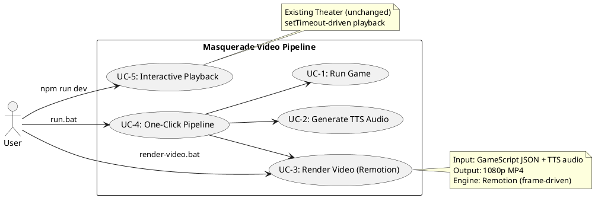
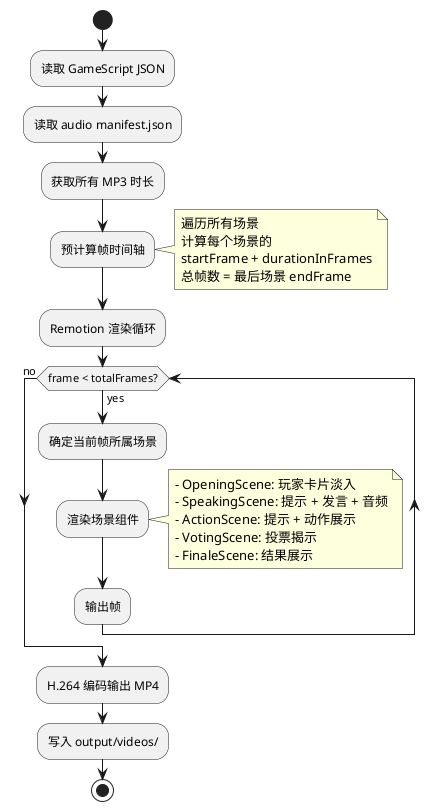

# REQ-013: Remotion 帧驱动视频渲染

## 1. Background & Motivation

当前视频导出方案基于 CDP screencast 录屏（REQ-012 后的 `scripts/record.py`），存在根本性缺陷：

- **帧率不稳定**：CDP screencast 按"有变化时"推送帧，静止画面不推送，导致视频时间轴与实际播放不一致
- **音画同步靠估算**：`_calculate_audio_timeline` 用文字长度估算偏移，与前端实际动画时间不匹配
- **码率低、画质差**：screencast 压缩严重，输出质量不可控
- **不可复现**：同一脚本两次录制产生不同结果

**根本原因**：当前是"录屏"实时播放，而非"渲染"确定性视频。

**解决方案**：采用 [Remotion](https://remotion.dev)，将 Theater 的渲染模型从时间驱动（setTimeout）改为帧驱动（frame-based），逐帧确定性渲染输出视频。

## 2. Goals

1. 使用 Remotion 实现帧驱动视频渲染，输入 GameScript JSON + TTS 音频，输出 MP4
2. 视频质量：1080p、30fps、音画完美同步
3. 复用现有 Theater 的视觉设计（布局、配色、动画效果）
4. 保留现有 Theater 交互式播放功能不受影响
5. 一键脚本：`scripts/render-video.bat` 完成视频渲染

## 3. Non-Goals

- 不替换现有 Theater 交互式播放（两套并行：交互式 + 视频渲染）
- 不改变现有 GameScript 数据结构
- 不改变 TTS 音频生成流程
- 不支持实时预览编辑（Remotion Studio 仅作为开发调试用）

## 4. Functional Requirements

### FR-1: Remotion 项目结构

在 `frontend/` 下新增 Remotion 渲染模块，与现有 Theater 共存：

```
frontend/
├── src/
│   ├── components/          # 现有 Theater 组件（不动）
│   ├── remotion/            # 新增：Remotion 视频渲染
│   │   ├── index.ts         # Remotion entry（registerRoot）
│   │   ├── Root.tsx         # Remotion Root composition
│   │   ├── Video.tsx        # 主 Composition 组件
│   │   ├── timeline.ts      # 帧驱动时间轴（预计算所有场景帧范围）
│   │   ├── scenes/          # 帧驱动场景组件
│   │   │   ├── OpeningScene.tsx
│   │   │   ├── SpeakingScene.tsx
│   │   │   ├── ActionScene.tsx
│   │   │   ├── VotingScene.tsx
│   │   │   ├── FinaleScene.tsx
│   │   │   └── RoundTitle.tsx
│   │   ├── components/      # 帧驱动共享组件
│   │   │   ├── AnimatedText.tsx
│   │   │   └── FadeTransition.tsx
│   │   └── utils/
│   │       └── frame-utils.ts
│   ├── types/               # 共享类型（GameScript 等）
│   └── ...
```

### FR-2: 帧驱动时间轴预计算

核心模块 `remotion/timeline.ts`：

- 输入：`GameScript` + 音频时长 map（从 manifest.json 读取）
- 输出：场景帧范围列表 `SceneFrameRange[]`

```typescript
interface SceneFrameRange {
  type: "opening" | "round-title" | "speaking" | "action" | "voting" | "finale";
  startFrame: number;
  durationInFrames: number;
  // 场景特有数据
  data: OpeningData | SpeakingData | ActionData | VotingData | FinaleData;
}
```

时间 → 帧转换规则（30fps）：
| 场景类型 | 时长计算 |
|---------|---------|
| opening | `playerCount * 300ms + 3000ms` |
| round-title | `2100ms` |
| speaking | `tipDuration + max(audioDuration, textDuration) + 800ms` |
| action | `tipDuration + contentDuration` (有文字: `len/15*1000+800ms`; 无文字: `3000ms`) |
| voting | `voterCount * 1200ms + 1000ms + 2500ms` |
| finale | `7000ms` |
| 场景间过渡 | `500ms`（fade out + fade in，叠加在场景首尾） |

其中 `tipDuration = strategyTip ? len(tip)/15*1000 + 500ms : 0`

**音频时长**：从 `output/audio/{gameId}/manifest.json` 读取实际 MP3 时长，用于 speaking 场景的精确时长计算。

### FR-3: 帧驱动场景组件

每个场景组件接收 `useCurrentFrame()` 和场景数据，通过帧号计算当前渲染状态：

#### FR-3.1: OpeningScene
- 玩家卡片依次淡入（每个间隔 300ms = 9 帧）
- 游戏标题、类型展示
- 复用现有布局和配色

#### FR-3.2: SpeakingScene（两阶段）
- **阶段 1（策略提示）**：帧驱动逐字显示，速率 15 字符/秒 = 每 2 帧一个字符
- **阶段 2（发言）**：speech bubble + 逐字显示 + `<Audio>` 组件同步播放 TTS
- 阶段切换由帧号判定：`frame < tipFrameCount ? "tip" : "speech"`

#### FR-3.3: ActionScene（两阶段）
- 策略提示 → 动作展示
- 文字类动作：逐字显示
- 目标类动作（保护/杀人/查验）：静态卡片展示 3 秒

#### FR-3.4: VotingScene
- 逐个揭示投票（每票 1.2 秒 = 36 帧）
- 结果展示 + 淘汰动画

#### FR-3.5: FinaleScene
- 胜利阵营展示 + 统计数据
- 交错淡入动画

#### FR-3.6: RoundTitle
- 回合号 + 阶段名（day/night）淡入淡出

### FR-4: 音频集成

- 使用 Remotion 的 `<Audio>` 组件嵌入 TTS 音频
- 音频起始帧 = speaking 场景的阶段 2 起始帧
- 音频文件路径通过 `staticFile()` 或预计算 URL 传入
- 无需后期合并，音频是 composition 的一部分

### FR-5: 视觉还原

复用现有 Theater 的视觉设计：
- 布局：三栏（左侧行动历史 + 中央场景 + 右侧发言历史）
- 配色：暗色主题，玩家颜色哈希映射
- 头像：圆形 + 首字母 + 角色标记
- 表情图标：复用 ExpressionIcon 映射
- 淘汰状态：灰度 + 红色 X
- 动画：淡入淡出、逐字显示、投票揭示

**注意**：Remotion 场景组件不使用 framer-motion，改用 Remotion 的 `interpolate()` + `spring()` 实现等效动画。

### FR-6: 渲染 CLI

新增 `scripts/render-video.ts`（或 .mjs），通过 Remotion CLI 渲染：

```bash
npx remotion render Video --props='{"scriptFile":"game_werewolf_xxx.json"}' out/video.mp4
```

封装为脚本：
- `scripts/render-video.bat` / `scripts/render-video.sh`
- 输入：script JSON 文件名
- 输出：`output/videos/{script_name}.mp4`
- 自动读取对应的音频目录

### FR-7: 一键流程集成

更新 `scripts/run.bat`：
- 游戏运行 → TTS 生成 → Remotion 渲染
- 替换原有的 Playwright 录制步骤

## 5. Technical Constraints

- **Remotion 版本**：4.x（当前稳定版）
- **渲染分辨率**：1920×1080（可配置）
- **帧率**：30fps
- **编码**：H.264 (libx264)，CRF 18
- **Tailwind CSS**：Remotion 组件中需配置 Tailwind 支持
- **字体**：确保中文字体可用（系统字体或打包字体）
- **音频格式**：MP3（现有 edge-tts 输出格式）

## 6. Shared Component Strategy

以下现有组件/类型可直接复用（import from 原位置）：
- `types/game-script.ts` — GameScript 类型定义
- `components/shared/PlayerAvatar.tsx` — 玩家头像（无 framer-motion 依赖）
- `components/shared/ExpressionIcon.tsx` — 表情映射

以下需要重写为帧驱动版本：
- `AnimatedText` → 帧驱动逐字显示
- 场景过渡 → `interpolate()` 淡入淡出
- 投票揭示 → 帧号判定

以下不复用：
- `TimelineController` — 替换为帧驱动时间轴
- `AudioManager` — 替换为 Remotion `<Audio>` 组件
- `PlaybackControls` — Remotion 有自己的 Player

## 7. Migration Impact

| 影响范围 | 说明 |
|---------|------|
| 现有 Theater | **不修改**，交互式播放完全保留 |
| `scripts/record.py` | 渲染成功后可废弃 |
| `scripts/record.bat` | 替换为 `scripts/render-video.bat` |
| `scripts/run.bat` | 更新录制步骤为 Remotion 渲染 |
| `package.json` | 新增 remotion 系列依赖 |
| `frontend/` 构建配置 | 需要 Remotion 独立入口（不影响 Vite dev server） |

## 8. Acceptance Criteria

- [ ] AC-1: `scripts/render-video.bat game_xxx.json` 输出 1080p MP4 视频
- [ ] AC-2: 视频包含所有场景（opening → rounds → finale），顺序和内容与交互式播放一致
- [ ] AC-3: 发言场景的 TTS 音频与文字动画精确同步（误差 < 100ms）
- [ ] AC-4: 视频帧率稳定 30fps，无掉帧或卡顿
- [ ] AC-5: 同一脚本多次渲染输出完全一致（确定性）
- [ ] AC-6: 现有 Theater 交互式播放功能不受影响（`npm run dev` 正常工作）
- [ ] AC-7: `scripts/run.bat` 一键完成：游戏运行 → TTS → 视频渲染

## 9. Use Case Diagram



## 10. Flow Diagram


