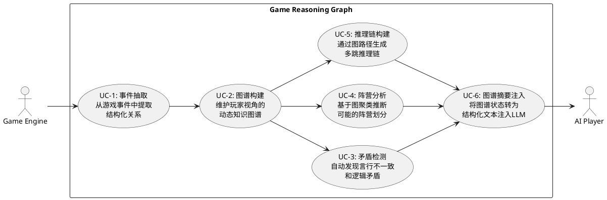

# REQ-018: GraphRAG 知识图谱推理在桌游 AI 中的应用分析

| Field | Value |
|:---|:---|
| ID | REQ-018 |
| Status | Completed |
| Created | 2026-03-20 |
| Type | 可行性研究 / 技术预研 |

---

## 1. 背景与动机

### 1.1 当前系统的推理架构

Masquerade 项目使用 **LangGraph 三节点管线**（Thinker → Evaluator → Optimizer）驱动 AI 玩家的决策：

- **Thinker**：接收公开状态 + 私密信息 + 记忆上下文，通过 LLM 生成局势分析和策略
- **Evaluator**：程序化验证 + LLM 评分，确保行动合规且质量达标
- **Optimizer**：润色输出使其自然、符合人设

信息传递方式为**线性记忆流**：每轮结束后，公开事件和私密思考以文本列表形式追加到 Memory，下一轮 LLM 调用时作为上下文注入。

### 1.2 当前架构的推理瓶颈

| 瓶颈 | 描述 | 影响 |
|:---|:---|:---|
| **线性记忆** | 记忆是事件的时间序列列表，无结构化关系 | 随着轮次增加，LLM 难以从长列表中提取关键关联 |
| **单次推理** | 每个决策点只有一次 Thinker LLM 调用（+重试） | 无法进行系统性的多跳推理（A→B→C 的推导链） |
| **隐式推理** | 玩家间的信任/怀疑关系完全隐含在 prompt 指导中 | LLM 可能遗忘或忽略跨轮次的矛盾信号 |
| **无矛盾检测** | 没有机制自动发现"言行不一致" | 例如某玩家 R1 说怀疑 X，R2 却投了 Y，这种矛盾依赖 LLM 自己发现 |
| **无阵营建模** | 没有显式的"可能的阵营划分"推理 | 狼人游戏中"站边"分析全靠 prompt 引导，无结构化支撑 |

### 1.3 GraphRAG 的核心概念

GraphRAG（Graph-based Retrieval-Augmented Generation）的关键思路：

1. **实体抽取**：从非结构化文本中提取实体和关系
2. **知识图谱构建**：将实体和关系建模为图结构
3. **社区检测**：对图进行层次化聚类，识别主题社区
4. **结构化检索**：基于图结构进行多跳、全局性检索
5. **图增强生成**：将图结构信息注入 LLM 上下文，提升推理质量

---

## 2. 核心分析：GraphRAG 概念在桌游推理中的映射

### 2.1 实体与关系建模

**桌游中的实体（Nodes）**：

| 实体类型 | 示例 | 属性 |
|:---|:---|:---|
| Player | 玩家 A、玩家 B | 存活状态、已知角色、可信度评分 |
| Claim | "我是预言家" | 发言者、轮次、类型（声明/指控/辩护） |
| Vote | 玩家 A 投票给玩家 B | 投票者、目标、轮次 |
| Event | 夜间死亡、平安夜 | 类型、轮次、涉及玩家 |
| Evidence | "玩家 B 的发言前后矛盾" | 来源、强度、指向 |

**桌游中的关系（Edges）**：

| 关系类型 | 示例 | 权重/属性 |
|:---|:---|:---|
| ACCUSES | 玩家 A 指控玩家 B | 轮次、证据强度 |
| DEFENDS | 玩家 A 为玩家 B 辩护 | 轮次、力度 |
| VOTES_FOR | 玩家 A 投票给玩家 B | 轮次 |
| CONTRADICTS | 声明 X 与声明 Y 矛盾 | 矛盾程度 |
| TRUSTS | 玩家 A 信任玩家 B | 信任度（动态） |
| SUSPECTS | 玩家 A 怀疑玩家 B | 怀疑度（动态） |
| CLAIMS_ROLE | 玩家 A 声称自己是预言家 | 轮次、可信度 |
| VERIFIED_BY | 玩家 A 被预言家验证为好人 | 轮次（仅私密信息） |

### 2.2 图谱推理能力与桌游场景的对应

#### 2.2.1 多跳推理 → 推理链构建

**GraphRAG 概念**：通过图的路径遍历，将 A→B→C 的间接关系链条化。

**桌游应用**：
```
前提1: 玩家 A 声称自己是预言家，验了 玩家 B 是好人
前提2: 玩家 C 也跳预言家，说验了 玩家 B 是狼人
推导: A 和 C 必有一个是假预言家
延伸: 如果 玩家 D 为 C 辩护 → D 可能是 C 的狼队友
```

在图谱中表示为：
```
A --[CLAIMS_ROLE]--> 预言家
A --[VERIFIED_BY: good]--> B
C --[CLAIMS_ROLE]--> 预言家
C --[VERIFIED_BY: wolf]--> B
A --[CONTRADICTS]--> C  （自动推导）
D --[DEFENDS]--> C
D --[SUSPECTS: inferred]--> 狼阵营  （多跳推导）
```

**价值**：当前系统依赖 LLM 在单次调用中完成这个推理链，容易遗漏。图谱可以**显式构建并持久化**这些推导，确保不被遗忘。

#### 2.2.2 社区检测 → 阵营分析

**GraphRAG 概念**：Leiden 算法等社区检测方法识别紧密关联的节点群。

**桌游应用**：
- **信任图社区** = 可能的阵营划分
- 互相辩护、投票一致的玩家聚类 → 疑似同阵营
- 互相指控的玩家分属不同聚类 → 疑似对立阵营

```
社区 1: {A, B, E} — 互相辩护，投票一致 → 疑似好人阵营 或 狼人抱团
社区 2: {C, D} — 互相辩护，被社区1指控 → 疑似对立阵营
孤立: {F} — 与谁都不紧密 → 信息不足，需进一步观察
```

**价值**：这是狼人杀中"站边"分析的结构化实现。当前完全依赖 LLM 的直觉判断，图谱社区检测可以提供**数据驱动的阵营假设**。

#### 2.2.3 矛盾检测 → 自动发现谎言

**GraphRAG 概念**：图谱中的关系约束检查。

**桌游应用**：
- **同一实体矛盾**：玩家 R1 说"我觉得 B 可疑"，R3 又说"B 一直很可靠" → 自动标记矛盾
- **角色约束矛盾**：两人都声称预言家 → 至少一个是假的（图谱约束：预言家 ≤ 1）
- **投票与发言矛盾**：口头说怀疑 X，但投票给了 Y → ACCUSES(→X) + VOTES_FOR(→Y) 矛盾
- **行为模式矛盾**：平安夜 + 某人声称用了解药 → 如果还有人死，则声明为假

**价值**：**这是 GraphRAG 在桌游中最有价值的应用点之一。** 程序化的矛盾检测比 LLM 的隐式推理更可靠、更全面。

#### 2.2.4 全局摘要 → 局势总览

**GraphRAG 概念**：社区摘要提供多层级的全局理解。

**桌游应用**：
- 不需要 LLM 从原始发言中提炼局势，图谱直接提供结构化的局势视图：
  - "当前有 2 个预言家声明，互相对跳"
  - "A-B-E 形成信任链，C-D 被多人指控"
  - "已发现 3 处矛盾：..."
  - "根据阵营分析，最可能的狼人组合是：..."

**价值**：随着游戏轮次增加，原始记忆列表越来越长。图谱摘要可以**压缩信息而不丢失关键关系**，解决上下文窗口压力。

---

## 3. 适用性评估

### 3.1 高度适用的方面 ✅

| 方面 | 理由 | 预期收益 |
|:---|:---|:---|
| **矛盾检测** | 桌游推理的核心就是发现谎言和不一致 | 显著提升发现言行矛盾的能力 |
| **阵营建模** | 社区检测天然适合"站边"分析 | 提供数据驱动的阵营假设 |
| **证据链追溯** | 图路径 = 推理链 | 使推理过程可解释、可追溯 |
| **信息压缩** | 图谱摘要替代线性记忆 | 解决长游戏的上下文窗口问题 |
| **跨轮次关联** | 图结构天然支持时间维度关联 | 避免 LLM 遗忘早期关键信息 |

### 3.2 需要适配的方面 ⚠️

| 方面 | 挑战 | 适配思路 |
|:---|:---|:---|
| **实体抽取精度** | 桌游发言比文档更口语化、更模糊 | 需要设计桌游领域专用的抽取 prompt |
| **关系动态性** | 信任/怀疑关系每轮都在变，不像知识库那样静态 | 图谱需要支持时间戳和版本化 |
| **信息不对称** | 每个玩家的图谱应不同（私密信息差异） | 需要分层图谱：公开层 + 私密层 |
| **计算开销** | 每轮都需要更新图谱 + 社区检测 | 需要轻量化实现，避免显著增加延迟 |
| **图谱规模小** | 6-12 个玩家 + 几十个声明，远小于 GraphRAG 的典型场景 | 社区检测等复杂算法可能过度设计 |

### 3.3 不太适用的方面 ❌

| 方面 | 理由 |
|:---|:---|
| **传统 GraphRAG 的文档检索** | 桌游不是文档问答，无需从海量文档中检索 |
| **层次化社区摘要** | 6-12 个玩家太少，不需要多层级社区 |
| **Embedding + 向量检索** | 数据量太小，直接结构化即可 |

---

## 4. 推荐方案：轻量级游戏推理图谱（Game Reasoning Graph）

### 4.1 概念定义

不是完整照搬 GraphRAG，而是**借鉴其核心思想**，设计一个适合桌游场景的轻量级推理图谱：

**Game Reasoning Graph (GRG)** = 面向桌游逻辑推理的动态知识图谱

### 4.2 架构核心：公共层 + 私有层分离

**设计原则**：避免为每个玩家维护一套完整的独立图谱，采用 **1 个公共图谱 + N 个轻量私有 overlay** 的分层架构。

```
┌──────────────────────────────────────────────────────────────┐
│                    Game Reasoning Graph                       │
│                                                              │
│  ┌────────────────────────────────────────────────────────┐  │
│  │              公共图谱层 (SharedGraph)                    │  │
│  │              全局唯一，所有玩家共享                        │  │
│  │                                                        │  │
│  │  数据来源：引擎事件（程序化，零 LLM 开销）                 │  │
│  │  ├── 投票关系：VOTES_FOR(A→B, round=2)                  │  │
│  │  ├── 发言关系：ACCUSES(A→C, round=1, evidence="...")    │  │
│  │  ├── 死亡事件：KILLED(C, round=2, cause="vote_out")     │  │
│  │  ├── 角色声明：CLAIMS_ROLE(A→预言家, round=1)            │  │
│  │  └── 公开矛盾：CONTRADICTS(A↔D, type="双预言家对跳")     │  │
│  │                                                        │  │
│  │  公共分析（只做一次，所有玩家复用）：                       │  │
│  │  ├── 投票模式分析（谁和谁投票一致？）                      │  │
│  │  ├── 公开矛盾检测（声明冲突、言行不一）                    │  │
│  │  ├── 阵营聚类（基于投票+辩护的社区检测）                   │  │
│  │  └── 发言关系抽取（指控/辩护/声明，LLM Phase 2）          │  │
│  └────────────────────────────────────────────────────────┘  │
│                          ↓ 继承                              │
│  ┌────────────────────────────────────────────────────────┐  │
│  │        私有图谱层 (PrivateOverlay × N 个玩家)            │  │
│  │        每个玩家一份，叠加在公共层之上                      │  │
│  │                                                        │  │
│  │  玩家 A（预言家）的 overlay：                             │  │
│  │  ├── VERIFIED(A→B, result="good", round=1)  ← 验人结果  │  │
│  │  ├── VERIFIED(A→C, result="wolf", round=2)              │  │
│  │  └── 私有推导：C 是狼 + D 帮 C 辩护 → D 嫌疑 +2         │  │
│  │                                                        │  │
│  │  玩家 E（狼人）的 overlay：                               │  │
│  │  ├── TEAMMATE(E↔F)  ← 知道队友是谁                      │  │
│  │  └── 私有推导：A 跳了预言家且验人准确 → A 是真预言家，危险  │  │
│  │                                                        │  │
│  │  玩家 G（普通村民）的 overlay：                            │  │
│  │  └── (无私密信息 — 但有认知偏好，见下方)                   │  │
│  └────────────────────────────────────────────────────────┘  │
│                          ↓ 叠加认知滤镜                       │
│  ┌────────────────────────────────────────────────────────┐  │
│  │        认知偏好层 (CognitiveBias × N 个玩家)             │  │
│  │        基于 persona 人设生成，决定"同样的事实→不同解读"    │  │
│  │                                                        │  │
│  │  每个玩家的认知偏好包含：                                 │  │
│  │  ├── evidence_weights  证据敏感度                        │  │
│  │  │   冲动型：{言行矛盾: 1.5, 投票模式: 0.7, 多数意见: 1.0}│  │
│  │  │   深沉型：{言行矛盾: 0.8, 投票模式: 1.5, 多数意见: 0.5}│  │
│  │  │   从众型：{言行矛盾: 0.6, 投票模式: 0.8, 多数意见: 1.8}│  │
│  │  │                                                     │  │
│  │  ├── conclusion_threshold  下结论的门槛                   │  │
│  │  │   冲动型：0.3（弱证据就敢下结论）                       │  │
│  │  │   深沉型：0.7（需要多条强证据才行动）                    │  │
│  │  │   犹豫型：0.9（总觉得证据不够）                         │  │
│  │  │                                                     │  │
│  │  ├── attention_focus  关注焦点                            │  │
│  │  │   冲动型：最近一轮（短期记忆偏重）                       │  │
│  │  │   深沉型：跨轮次投票趋势（长期数据偏重）                  │  │
│  │  │   从众型：多数人投票方向（社会信号偏重）                  │  │
│  │  │                                                     │  │
│  │  └── stubbornness  固执度                                │  │
│  │      冲动型：0.3（容易被说服改变想法）                      │  │
│  │      深沉型：0.8（一旦形成判断很难动摇）                    │  │
│  │      犹豫型：0.2（谁说的都有道理，反复摇摆）                │  │
│  └────────────────────────────────────────────────────────┘  │
│                          ↓ 合并                              │
│  ┌────────────────────────────────────────────────────────┐  │
│  │              推理与摘要（每玩家视角）                      │  │
│  │                                                        │  │
│  │  合并视图 = 公共图谱 + 私有 overlay + 认知偏好             │  │
│  │  ├── 矛盾检测：公共矛盾(复用) + 私有矛盾(增量)           │  │
│  │  ├── 推理链构建：按 evidence_weights 加权排序证据          │  │
│  │  ├── 结论生成：按 conclusion_threshold 决定是否形成判断    │  │
│  │  └── 图谱摘要：公共摘要(复用) + 私有补充 + 偏好过滤        │  │
│  │                                                        │  │
│  │  同一事实，不同输出示例：                                  │  │
│  │  事实：D 在 R1 说怀疑 C，但 R2 投了别人                   │  │
│  │  冲动型→"D说一套做一套，高度可疑！"（矛盾权重1.5，门槛0.3）│  │
│  │  深沉型→"D的投票变化值得观察，暂不下结论"（门槛0.7未达）   │  │
│  │  从众型→"大家好像都在说C可疑，那先投C"（关注多数意见）     │  │
│  └────────────────────────────────────────────────────────┘  │
└──────────────────────────────────────────────────────────────┘
```

#### 为什么这样分层？

| 问题 | 如果不分层（12 份独立图谱） | 分层后（1 公共 + 12 overlay） |
|:---|:---|:---|
| **投票分析** | 同样的投票矩阵分析做 12 次 | 做 1 次，12 人复用 |
| **发言抽取** | 同样的发言 LLM 抽取做 12 次 | 做 1 次，12 人复用 |
| **阵营聚类** | 12 次相同的社区检测 | 做 1 次（公共），私有层仅微调权重 |
| **矛盾检测** | 公开矛盾重复检测 12 次 | 公开矛盾 1 次 + 每人增量私有矛盾 |
| **摘要生成** | 12 份完整摘要 | 1 份公共摘要 + 每人几行私有补充 |
| **LLM 调用** | Phase 2 每轮 12 次抽取 | Phase 2 每轮 1 次抽取 |

**节省比例**：公共分析占总工作量的 ~80%，分层后计算量降为原来的 ~**1/6**。

### 4.3 核心组件

#### 组件 1: 事件抽取器 (Event Extractor)

从每轮游戏事件中提取结构化关系，写入**公共图谱层**：
- **程序化抽取**（零 LLM 开销）：投票、死亡、技能使用 → 直接从引擎数据转换
- **LLM 辅助抽取**（Phase 2，按需）：发言内容 → 提取指控、辩护、声明等语义关系
- **仅做一次**：所有玩家共享抽取结果

#### 组件 2: 图谱构建器 (Graph Builder)

维护分层图谱结构：
- **公共图谱 (SharedGraph)**：单例，包含所有公开事件和关系
- **私有覆盖层 (PrivateOverlay)**：每玩家一份，包含该玩家独有的私密边和推导
- **合并视图 (MergedView)**：查询时动态合并，公共 + 私有 overlay

#### 组件 3: 推理引擎 (Reasoner)

分两层执行推理：
- **公共推理**（做一次）：
  - 投票模式匹配（投票一致的玩家群）
  - 角色约束检查（预言家 ≤ 1 等）
  - 阵营聚类（基于公开信息的社区检测）
- **私有推理**（每玩家增量）：
  - 路径推理：基于私密信息的推导（如：我知道 C 是狼 → D 帮 C → D 可能是狼）
  - 信任权重调整：基于验人结果等调整信任/怀疑边的权重

#### 组件 4: 矛盾检测器 (Conflict Detector)

分层检测：
- **公共矛盾**（做一次）：言行矛盾、声明互斥、角色约束冲突
- **私有矛盾**（每玩家增量）：基于私密信息发现的额外矛盾
  - 例：预言家知道 B 是好人，但有人投票 B → 对该玩家来说这是可疑行为

#### 组件 5: 图谱摘要器 (Graph Summarizer)

分层生成摘要：
```
【公共摘要】（所有玩家共享，只生成一次）
- 阵营假设：{A, B, E} vs {C, D}，F 未定
- 公开矛盾：C 声称预言家与 A 对跳（强矛盾）
- 投票模式：A/B/E 连续 2 轮投票一致

【私有补充 — 玩家 A 视角】（仅几行增量）
- 我验了 B 是好人(R1)、C 是狼人(R2)
- 推导：D 在 R2 为 C 辩护 → D 可能是狼队友
- 我方阵营修正：{A, B, E} 可信 → C, D 是目标
```

### 4.4 与现有架构的集成方式

```
现有流程:
  GameEngine → Memory(线性) → Thinker(LLM) → Evaluator → Optimizer

增强流程:
  GameEngine → SharedGraph.update(公开事件)     ← 每轮一次
           → PrivateOverlay[pid].update(私密)   ← 每玩家一次（仅有私密信息的角色）
           → Memory(线性，保留)

  每个玩家决策时:
    MergedView = SharedGraph + PrivateOverlay[pid]
    公共摘要 = SharedGraph.summarize()           ← 缓存复用
    私有补充 = PrivateOverlay[pid].summarize()   ← 轻量
    矛盾列表 = 公共矛盾(缓存) + 私有矛盾(增量)

    → 注入 Thinker 上下文（公共摘要 + 私有补充）
    → 注入 Evaluator 上下文（矛盾列表）
```

**关键设计原则**：
- GRG 是 Memory 的**补充而非替代** — 线性记忆仍然保留
- **公共分析只做一次** — 每轮结束时更新公共图谱并缓存分析结果
- **私有层极轻量** — 大部分玩家（村民）的 overlay 几乎为空
- 图谱摘要作为额外上下文注入 Thinker prompt — 不改变现有 prompt 结构
- 矛盾检测结果注入 Evaluator — 帮助验证 Thinker 是否忽略了关键矛盾
- **渐进式采用** — 可以先只实现程序化部分（投票图、矛盾检测），再逐步引入 LLM 抽取

### 4.4 实现路径建议

| 阶段 | 内容 | 复杂度 | LLM 开销 |
|:---|:---|:---|:---|
| **Phase 1** | 程序化关系图（投票、死亡、技能） + 简单矛盾检测 | 低 | 零 |
| **Phase 2** | LLM 发言抽取（指控/辩护/声明） + 完整矛盾检测 | 中 | 每轮 1 次 LLM 调用 |
| **Phase 3** | 阵营聚类（简单图算法，非 Leiden） + 图谱摘要注入 | 中 | 零 |
| **Phase 4** | 推理引擎（路径推理 + 约束检查） | 高 | 零 |

---

## 5. 成本与收益分析

### 5.1 收益

| 收益 | 量化预期 |
|:---|:---|
| 矛盾发现率提升 | 当前估计 LLM 捕获 ~50% 的跨轮矛盾，图谱可提升到 90%+ |
| 推理深度增加 | 从单跳推理（A→B）扩展到 3-4 跳推理链 |
| 上下文窗口节省 | 图谱摘要比原始发言列表压缩 60-70% |
| 策略一致性 | 显式的信任/怀疑图谱避免玩家"健忘" |
| 可解释性 | 每个决策可追溯到具体的图谱路径和证据链 |

### 5.2 成本

| 成本 | 评估 |
|:---|:---|
| 开发复杂度 | Phase 1-2 约 500-800 行代码，Phase 3-4 约 1000-1500 行 |
| 运行时开销 | Phase 1 零 LLM 开销，Phase 2 每轮额外 1 次 LLM 调用 |
| 维护成本 | 图谱逻辑需要随游戏规则变化而更新 |
| 集成风险 | 低 — 纯增量设计，不修改现有核心流程 |

---

## 6. 结论

### 6.1 核心判断

**GraphRAG 的图谱推理概念高度适用于桌游 AI 的逻辑推理，但不应照搬 GraphRAG 的完整技术栈。**

理由：
- **适用的是思想而非实现** — GraphRAG 设计用于大规模文档检索，桌游场景的数据量小几个数量级
- **最有价值的是结构化推理** — 矛盾检测、阵营建模、推理链构建是桌游最需要的能力
- **最不需要的是检索增强** — 桌游不存在"从海量文档中检索"的需求
- **轻量级实现即可获得大部分收益** — 简单的 NetworkX 图 + 程序化矛盾检测就能解决最痛的问题

### 6.2 推荐行动

1. **立项 Phase 1** — 实现程序化关系图 + 矛盾检测（低成本、高收益）
2. **观察效果** — 在几轮游戏中评估图谱注入后 AI 推理质量的变化
3. **按需推进** — 如果 Phase 1 效果显著，再推进 Phase 2-4

### 6.3 你的直觉是对的

你提到的"通过对图谱的分析建立正经的逻辑思路"确实是 GraphRAG 最核心的价值之一。但需要精确理解：

- **图谱提供的是推理的结构和约束** — 而非推理本身
- **"正经的逻辑"来自图的拓扑结构** — 路径、环、矛盾、社区，这些是**形式化的、可验证的**
- **LLM 仍然负责"判断"** — 但它获得了更好的、结构化的输入

这比纯粹依赖 LLM 的"感觉"做推理，要**可靠得多、可解释得多**。

---

## 7. 用例图


