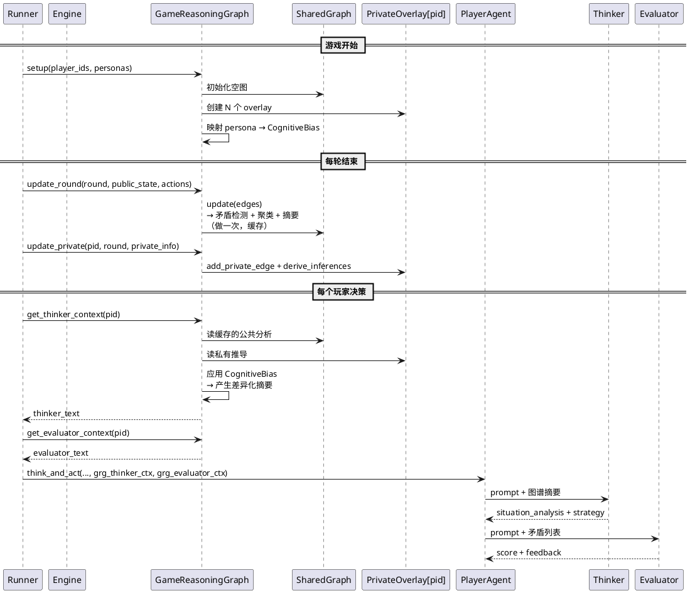

# REQ-018 技术设计：Game Reasoning Graph (GRG)

| Field | Value |
|:---|:---|
| ID | REQ-018 |
| Status | Completed |
| Created | 2026-03-20 |

---

## 1. 设计目标

为 Masquerade 桌游 AI 引入基于知识图谱的结构化推理能力，作为现有线性 Memory 的补充。

**核心约束**：
- 独立包 `backend/reasoning/`，与 `agent/`、`engine/` 低耦合
- 公共分析只做一次，N 个玩家复用
- 认知偏好产生差异化推理，避免所有村民结论雷同
- 渐进式集成，不破坏现有 Thinker → Evaluator → Optimizer 管线

---

## 2. 包结构

```
backend/reasoning/                 # 独立包：Game Reasoning Graph
├── __init__.py                    # 公开 API：GameReasoningGraph
├── models.py                      # 数据模型：节点、边、认知偏好
├── shared_graph.py                # 公共图谱层（单例，所有玩家共享）
├── private_overlay.py             # 私有覆盖层（每玩家一份）
├── cognitive_bias.py              # 认知偏好：persona → 证据权重映射
├── extractor.py                   # 事件抽取器：引擎事件 → 图谱关系
├── conflict_detector.py           # 矛盾检测器
├── reasoner.py                    # 推理引擎：路径推理、约束检查
└── summarizer.py                  # 图谱摘要器：图谱 → 结构化文本
```

**依赖方向**（严格单向）：
```
engine/ ←── reasoning/ ──→ (无外部依赖，纯 Python + NetworkX)
                ↑
         orchestrator/runner.py（集成点）
         agent/player.py（注入图谱摘要）
```

`reasoning` 包只读取 engine 的公开数据（public_state, Action），不反向依赖 agent 或 orchestrator。

---

## 3. 数据模型 — `models.py`

```python
"""Data models for the Game Reasoning Graph."""

from dataclasses import dataclass, field
from enum import Enum


# ──────────────────────────────────────────────
#  图谱节点与边
# ──────────────────────────────────────────────

class NodeType(Enum):
    PLAYER = "player"
    CLAIM = "claim"        # 声明（"我是预言家"）
    EVENT = "event"        # 事件（死亡、平安夜）


class EdgeType(Enum):
    VOTES_FOR = "votes_for"
    ACCUSES = "accuses"
    DEFENDS = "defends"
    CLAIMS_ROLE = "claims_role"
    CONTRADICTS = "contradicts"
    VERIFIED = "verified"          # 预言家验人（私有）
    TEAMMATE = "teammate"          # 狼人队友（私有）
    KILLED = "killed"              # 被杀


@dataclass
class GraphNode:
    id: str
    type: NodeType
    round: int = 0
    attrs: dict = field(default_factory=dict)


@dataclass
class GraphEdge:
    source: str
    target: str
    type: EdgeType
    round: int = 0
    weight: float = 1.0
    attrs: dict = field(default_factory=dict)


# ──────────────────────────────────────────────
#  矛盾
# ──────────────────────────────────────────────

class ConflictSeverity(Enum):
    LOW = "low"            # 值得关注
    MEDIUM = "medium"      # 可疑
    HIGH = "high"          # 强烈矛盾


@dataclass
class Conflict:
    description: str
    severity: ConflictSeverity
    involved_players: list[str]
    round_detected: int
    evidence: list[str] = field(default_factory=list)


# ──────────────────────────────────────────────
#  认知偏好
# ──────────────────────────────────────────────

class AttentionFocus(Enum):
    RECENT = "recent"            # 短期记忆偏重
    LONG_TERM = "long_term"      # 跨轮次趋势偏重
    SOCIAL = "social"            # 多数人意见偏重
    DETAIL = "detail"            # 细节证据偏重


@dataclass
class CognitiveBias:
    """每个玩家的认知偏好 — 决定同样事实产出不同解读。"""

    evidence_weights: dict[str, float]       # 证据类型 → 敏感度系数
    conclusion_threshold: float              # 下结论的门槛 (0.0~1.0)
    attention_focus: AttentionFocus          # 关注焦点
    stubbornness: float                      # 固执度 (0.0~1.0)


# ──────────────────────────────────────────────
#  推理链
# ──────────────────────────────────────────────

@dataclass
class ReasoningChain:
    """一条推理路径：前提 → 推导 → 结论。"""
    premises: list[str]
    conclusion: str
    confidence: float    # 0.0~1.0
    path: list[str]      # 图谱中的节点路径


# ──────────────────────────────────────────────
#  图谱摘要
# ──────────────────────────────────────────────

@dataclass
class GraphSummary:
    """注入 Thinker 上下文的结构化摘要。"""

    faction_hypothesis: str         # 阵营假设文本
    active_conflicts: list[str]     # 活跃矛盾列表（文本）
    reasoning_chains: list[str]     # 关键推理链（文本）
    trust_map: dict[str, float]     # 玩家 → 信任度
    suspicion_map: dict[str, float] # 玩家 → 怀疑度
    attention_hint: str             # 基于认知偏好的关注提示
```

---

## 4. 公共图谱层 — `shared_graph.py`

**职责**：维护全局唯一的事实图谱，所有玩家共享。

```python
"""SharedGraph — the single source of truth for public game events."""


class SharedGraph:
    """公共图谱：存储所有公开可见的事实和关系。

    所有分析结果（矛盾、聚类、摘要）被缓存，
    每轮调用 update() 后重新计算一次，N 个玩家复用。
    """

    def __init__(self) -> None: ...

    # ── 公开编排方法 ──

    def update(self, round_number: int, events: list[GraphEdge]) -> None:
        """每轮结束时调用：写入新边，刷新所有缓存分析。"""
        self._add_edges(events)
        self._refresh_public_analysis(round_number)

    def get_public_conflicts(self) -> list[Conflict]:
        """返回缓存的公开矛盾列表。"""
        ...

    def get_faction_clusters(self) -> dict[str, list[str]]:
        """返回缓存的阵营聚类结果。"""
        ...

    def get_public_summary_text(self) -> str:
        """返回缓存的公共摘要文本。"""
        ...

    def get_vote_alignment(self) -> dict[tuple[str, str], int]:
        """返回缓存的投票一致性矩阵。"""
        ...

    # ── 私有步骤方法 ──

    def _add_edges(self, events: list[GraphEdge]) -> None:
        """将新边写入底层图。"""
        ...

    def _refresh_public_analysis(self, round_number: int) -> None:
        """刷新全部公共分析缓存（编排方法）。"""
        self._detect_public_conflicts(round_number)
        self._compute_vote_alignment()
        self._compute_faction_clusters()
        self._generate_public_summary()

    def _detect_public_conflicts(self, round_number: int) -> None:
        """扫描图谱，检测公开矛盾（声明冲突、言行不一）。"""
        ...

    def _compute_vote_alignment(self) -> None:
        """计算投票一致性矩阵。"""
        ...

    def _compute_faction_clusters(self) -> None:
        """基于投票+辩护关系的简单社区检测。"""
        ...

    def _generate_public_summary(self) -> None:
        """生成公共摘要文本。"""
        ...
```

**关键点**：
- `_refresh_public_analysis` 是编排方法，包含 4 个步骤，每个步骤是一个语义清晰的私有方法
- 所有分析结果缓存在实例属性中，N 个玩家读取时零计算

---

## 5. 私有覆盖层 — `private_overlay.py`

**职责**：存储每个玩家独有的私密边和主观推导。

```python
"""PrivateOverlay — per-player private edges and derived reasoning."""


class PrivateOverlay:
    """私有图谱层：叠加在公共图谱之上，存储私密信息和主观推导。

    对村民来说几乎为空（无私密信息）。
    对预言家/狼人等角色，存储验人结果、队友关系等。
    """

    def __init__(self, player_id: str) -> None: ...

    # ── 公开编排方法 ──

    def add_private_edge(self, edge: GraphEdge) -> None:
        """添加一条私密边（验人结果、队友关系等）。"""
        ...

    def derive_inferences(self, shared: SharedGraph) -> None:
        """基于私密信息 + 公共图谱，推导私有推论。"""
        self._infer_from_private_knowledge(shared)
        self._detect_private_conflicts(shared)

    def get_private_conflicts(self) -> list[Conflict]:
        """返回基于私密信息发现的额外矛盾。"""
        ...

    def get_private_edges(self) -> list[GraphEdge]:
        """返回所有私密边。"""
        ...

    def get_inferences(self) -> list[ReasoningChain]:
        """返回所有私有推导。"""
        ...

    # ── 私有步骤方法 ──

    def _infer_from_private_knowledge(self, shared: SharedGraph) -> None:
        """基于私密知识（如验人结果）推导：谁在帮狼人说话？"""
        ...

    def _detect_private_conflicts(self, shared: SharedGraph) -> None:
        """基于私密知识检测额外矛盾。"""
        ...
```

---

## 6. 认知偏好 — `cognitive_bias.py`

**职责**：将 persona 人设映射为量化的认知参数，产生差异化推理。

```python
"""CognitiveBias — maps persona to quantified reasoning preferences."""


# ── 预定义偏好模板 ──

BIAS_TEMPLATES: dict[str, CognitiveBias] = {
    "impulsive": CognitiveBias(
        evidence_weights={
            "speech_contradiction": 1.5,
            "vote_pattern": 0.7,
            "role_claim_conflict": 1.2,
            "social_consensus": 1.0,
        },
        conclusion_threshold=0.3,
        attention_focus=AttentionFocus.RECENT,
        stubbornness=0.3,
    ),
    "analytical": CognitiveBias(
        evidence_weights={
            "speech_contradiction": 1.0,
            "vote_pattern": 1.5,
            "role_claim_conflict": 1.3,
            "social_consensus": 0.5,
        },
        conclusion_threshold=0.7,
        attention_focus=AttentionFocus.LONG_TERM,
        stubbornness=0.8,
    ),
    "conformist": CognitiveBias(
        evidence_weights={
            "speech_contradiction": 0.6,
            "vote_pattern": 0.8,
            "role_claim_conflict": 0.9,
            "social_consensus": 1.8,
        },
        conclusion_threshold=0.4,
        attention_focus=AttentionFocus.SOCIAL,
        stubbornness=0.2,
    ),
    "hesitant": CognitiveBias(
        evidence_weights={
            "speech_contradiction": 1.0,
            "vote_pattern": 1.0,
            "role_claim_conflict": 1.0,
            "social_consensus": 0.8,
        },
        conclusion_threshold=0.9,
        attention_focus=AttentionFocus.DETAIL,
        stubbornness=0.2,
    ),
}


def resolve_cognitive_bias(persona: str) -> CognitiveBias:
    """从 persona 描述中匹配最接近的认知偏好模板。

    通过关键词匹配：冲动/果断 → impulsive, 深沉/分析 → analytical, 等等。
    无法匹配时返回中性偏好（所有权重 1.0，门槛 0.5）。
    """
    ...


def apply_bias_to_conflicts(
    conflicts: list[Conflict],
    bias: CognitiveBias,
) -> list[Conflict]:
    """按认知偏好对矛盾列表重新加权排序。

    冲动型：言行矛盾排在前面，权重放大
    深沉型：投票模式排在前面
    从众型：多数人关注的矛盾排在前面
    """
    ...


def apply_bias_to_trust(
    base_trust: dict[str, float],
    bias: CognitiveBias,
    shared: SharedGraph,
) -> dict[str, float]:
    """按认知偏好调整信任度。

    从众型：多数人信任的人 → 信任度上升
    深沉型：逻辑链完整的人 → 信任度上升
    冲动型：最近发言可疑的人 → 信任度快速下降
    """
    ...
```

**这是"同样公共图谱，不同结论"的核心机制。**

---

## 7. 事件抽取器 — `extractor.py`

**职责**：将引擎事件转换为图谱边。

```python
"""EventExtractor — converts engine events to graph edges."""


class EventExtractor:
    """事件抽取器：引擎数据 → 图谱关系。

    Phase 1: 纯程序化抽取（投票、死亡、技能）— 零 LLM 开销
    Phase 2: LLM 辅助抽取（发言语义分析）— 每轮 1 次 LLM 调用
    """

    # ── 公开编排方法 ──

    def extract_round_events(
        self,
        round_number: int,
        public_state: dict,
        actions: list[Action],
    ) -> list[GraphEdge]:
        """从一轮的引擎数据中抽取所有公开关系。"""
        edges = []
        edges.extend(self._extract_votes(round_number, public_state))
        edges.extend(self._extract_deaths(round_number, public_state))
        edges.extend(self._extract_role_claims(round_number, actions))
        return edges

    def extract_private_events(
        self,
        player_id: str,
        round_number: int,
        private_info: dict,
    ) -> list[GraphEdge]:
        """从私密信息中抽取私有关系（验人结果、队友等）。"""
        edges = []
        edges.extend(self._extract_verifications(player_id, round_number, private_info))
        edges.extend(self._extract_teammate_info(player_id, round_number, private_info))
        return edges

    # ── 私有步骤方法 ──

    def _extract_votes(self, round_number: int, public_state: dict) -> list[GraphEdge]:
        """从 public_state.vote_history 抽取投票边。"""
        ...

    def _extract_deaths(self, round_number: int, public_state: dict) -> list[GraphEdge]:
        """从死亡信息抽取 KILLED 边。"""
        ...

    def _extract_role_claims(self, round_number: int, actions: list[Action]) -> list[GraphEdge]:
        """从发言行动中检测角色声明（"我是预言家"等关键词匹配）。"""
        ...

    def _extract_verifications(self, player_id: str, round_number: int, private_info: dict) -> list[GraphEdge]:
        """从预言家的私密信息中抽取验人结果。"""
        ...

    def _extract_teammate_info(self, player_id: str, round_number: int, private_info: dict) -> list[GraphEdge]:
        """从狼人的私密信息中抽取队友关系。"""
        ...
```

---

## 8. 矛盾检测器 — `conflict_detector.py`

```python
"""ConflictDetector — scans graph for logical contradictions."""


class ConflictDetector:
    """矛盾检测器：自动发现图谱中的逻辑矛盾。"""

    # ── 公开编排方法 ──

    def detect_public(self, shared: SharedGraph, round_number: int) -> list[Conflict]:
        """检测所有公开矛盾（每轮做一次，所有玩家复用）。"""
        conflicts = []
        conflicts.extend(self._detect_vote_speech_contradiction(shared, round_number))
        conflicts.extend(self._detect_role_claim_conflicts(shared))
        conflicts.extend(self._detect_attitude_flip(shared, round_number))
        return conflicts

    def detect_private(
        self,
        shared: SharedGraph,
        overlay: PrivateOverlay,
        round_number: int,
    ) -> list[Conflict]:
        """基于私密信息检测额外矛盾（每玩家增量）。"""
        conflicts = []
        conflicts.extend(self._detect_defense_of_known_wolf(shared, overlay))
        conflicts.extend(self._detect_vote_against_known_good(shared, overlay))
        return conflicts

    # ── 私有步骤方法 ──

    def _detect_vote_speech_contradiction(self, shared: SharedGraph, round_number: int) -> list[Conflict]:
        """检测言行矛盾：口头说怀疑 X，但投票给了 Y。"""
        ...

    def _detect_role_claim_conflicts(self, shared: SharedGraph) -> list[Conflict]:
        """检测角色约束矛盾：多人声称同一唯一角色。"""
        ...

    def _detect_attitude_flip(self, shared: SharedGraph, round_number: int) -> list[Conflict]:
        """检测态度翻转：R1 怀疑 X，R2 辩护 X。"""
        ...

    def _detect_defense_of_known_wolf(self, shared: SharedGraph, overlay: PrivateOverlay) -> list[Conflict]:
        """私有矛盾：某人帮已知狼人辩护。"""
        ...

    def _detect_vote_against_known_good(self, shared: SharedGraph, overlay: PrivateOverlay) -> list[Conflict]:
        """私有矛盾：某人投票给已知好人。"""
        ...
```

---

## 9. 推理引擎 — `reasoner.py`

```python
"""Reasoner — graph-based logical inference engine."""


class Reasoner:
    """推理引擎：基于图结构执行推理。"""

    # ── 公开编排方法 ──

    def reason(
        self,
        shared: SharedGraph,
        overlay: PrivateOverlay,
        bias: CognitiveBias,
        alive_players: list[str],
    ) -> tuple[dict[str, float], dict[str, float], list[ReasoningChain]]:
        """执行完整推理，返回 (信任图, 怀疑图, 推理链列表)。"""
        base_trust, base_suspicion = self._compute_base_scores(shared, alive_players)
        private_adjustments = self._apply_private_knowledge(overlay, base_trust, base_suspicion)
        biased_trust = apply_bias_to_trust(private_adjustments[0], bias, shared)
        biased_suspicion = apply_bias_to_trust(private_adjustments[1], bias, shared)
        chains = self._build_reasoning_chains(shared, overlay, bias)
        return biased_trust, biased_suspicion, chains

    # ── 私有步骤方法 ──

    def _compute_base_scores(
        self, shared: SharedGraph, alive_players: list[str],
    ) -> tuple[dict[str, float], dict[str, float]]:
        """基于公共图谱计算基础信任/怀疑分数。"""
        ...

    def _apply_private_knowledge(
        self, overlay: PrivateOverlay,
        trust: dict[str, float], suspicion: dict[str, float],
    ) -> tuple[dict[str, float], dict[str, float]]:
        """用私密信息修正信任/怀疑分数。"""
        ...

    def _build_reasoning_chains(
        self, shared: SharedGraph, overlay: PrivateOverlay, bias: CognitiveBias,
    ) -> list[ReasoningChain]:
        """构建推理链：从强证据出发，沿图路径推导。"""
        ...
```

---

## 10. 图谱摘要器 — `summarizer.py`

```python
"""GraphSummarizer — converts graph state to structured text for LLM injection."""


class GraphSummarizer:
    """图谱摘要器：将图谱状态转为 Thinker/Evaluator 可用的结构化文本。"""

    # ── 公开编排方法 ──

    def summarize(
        self,
        shared: SharedGraph,
        overlay: PrivateOverlay,
        bias: CognitiveBias,
        trust_map: dict[str, float],
        suspicion_map: dict[str, float],
        conflicts: list[Conflict],
        chains: list[ReasoningChain],
    ) -> GraphSummary:
        """生成完整的图谱摘要。"""
        faction_text = self._format_faction_hypothesis(shared)
        conflict_texts = self._format_conflicts(conflicts, bias)
        chain_texts = self._format_reasoning_chains(chains, bias)
        attention = self._generate_attention_hint(bias, conflicts)
        return GraphSummary(
            faction_hypothesis=faction_text,
            active_conflicts=conflict_texts,
            reasoning_chains=chain_texts,
            trust_map=trust_map,
            suspicion_map=suspicion_map,
            attention_hint=attention,
        )

    def to_thinker_text(self, summary: GraphSummary) -> str:
        """将 GraphSummary 格式化为注入 Thinker prompt 的文本块。"""
        ...

    def to_evaluator_text(self, conflicts: list[Conflict]) -> str:
        """将矛盾列表格式化为注入 Evaluator prompt 的文本块。"""
        ...

    # ── 私有步骤方法 ──

    def _format_faction_hypothesis(self, shared: SharedGraph) -> str:
        """格式化阵营假设文本。"""
        ...

    def _format_conflicts(self, conflicts: list[Conflict], bias: CognitiveBias) -> list[str]:
        """按认知偏好排序、格式化矛盾列表。"""
        ...

    def _format_reasoning_chains(self, chains: list[ReasoningChain], bias: CognitiveBias) -> list[str]:
        """按认知偏好筛选、格式化推理链。"""
        ...

    def _generate_attention_hint(self, bias: CognitiveBias, conflicts: list[Conflict]) -> str:
        """基于认知偏好生成关注提示。"""
        ...
```

---

## 11. 门面类 — `__init__.py`

```python
"""Game Reasoning Graph — public API."""

from backend.reasoning.cognitive_bias import resolve_cognitive_bias, apply_bias_to_conflicts
from backend.reasoning.conflict_detector import ConflictDetector
from backend.reasoning.extractor import EventExtractor
from backend.reasoning.models import GraphSummary, CognitiveBias
from backend.reasoning.private_overlay import PrivateOverlay
from backend.reasoning.reasoner import Reasoner
from backend.reasoning.shared_graph import SharedGraph
from backend.reasoning.summarizer import GraphSummarizer


class GameReasoningGraph:
    """门面类：对外暴露简洁 API，内部编排所有子组件。

    Runner 只需调用:
    - setup(): 游戏开始时初始化
    - update_round(): 每轮结束时更新公共图谱
    - update_private(): 有私密信息时更新私有层
    - get_thinker_context(): 获取注入 Thinker 的图谱摘要
    - get_evaluator_context(): 获取注入 Evaluator 的矛盾列表
    """

    def __init__(self) -> None:
        self._shared = SharedGraph()
        self._overlays: dict[str, PrivateOverlay] = {}
        self._biases: dict[str, CognitiveBias] = {}
        self._extractor = EventExtractor()
        self._conflict_detector = ConflictDetector()
        self._reasoner = Reasoner()
        self._summarizer = GraphSummarizer()

    # ── 公开编排方法 ──

    def setup(self, player_ids: list[str], personas: dict[str, str]) -> None:
        """游戏开始时调用：为每个玩家创建 overlay 和认知偏好。"""
        for pid in player_ids:
            self._overlays[pid] = PrivateOverlay(pid)
            self._biases[pid] = resolve_cognitive_bias(personas.get(pid, ""))

    def update_round(
        self,
        round_number: int,
        public_state: dict,
        actions: list,
    ) -> None:
        """每轮结束时调用：抽取公开事件，更新公共图谱。"""
        edges = self._extractor.extract_round_events(round_number, public_state, actions)
        self._shared.update(round_number, edges)

    def update_private(
        self,
        player_id: str,
        round_number: int,
        private_info: dict,
    ) -> None:
        """有私密信息变更时调用：更新玩家私有层。"""
        edges = self._extractor.extract_private_events(player_id, round_number, private_info)
        overlay = self._overlays[player_id]
        for edge in edges:
            overlay.add_private_edge(edge)
        overlay.derive_inferences(self._shared)

    def get_thinker_context(self, player_id: str, alive_players: list[str]) -> str:
        """获取注入 Thinker prompt 的图谱摘要文本。"""
        overlay = self._overlays[player_id]
        bias = self._biases[player_id]
        trust, suspicion, chains = self._reasoner.reason(
            self._shared, overlay, bias, alive_players,
        )
        public_conflicts = self._shared.get_public_conflicts()
        private_conflicts = self._conflict_detector.detect_private(
            self._shared, overlay, self._shared._current_round,
        )
        all_conflicts = apply_bias_to_conflicts(
            public_conflicts + private_conflicts, bias,
        )
        summary = self._summarizer.summarize(
            self._shared, overlay, bias, trust, suspicion, all_conflicts, chains,
        )
        return self._summarizer.to_thinker_text(summary)

    def get_evaluator_context(self, player_id: str) -> str:
        """获取注入 Evaluator prompt 的矛盾列表文本。"""
        overlay = self._overlays[player_id]
        public_conflicts = self._shared.get_public_conflicts()
        private_conflicts = self._conflict_detector.detect_private(
            self._shared, overlay, self._shared._current_round,
        )
        bias = self._biases[player_id]
        all_conflicts = apply_bias_to_conflicts(
            public_conflicts + private_conflicts, bias,
        )
        return self._summarizer.to_evaluator_text(all_conflicts)
```

---

## 12. 集成方式

### 12.1 Runner 集成（`orchestrator/runner.py`）

修改点极小 — 在游戏循环中插入图谱更新调用：

```python
# GameRunner.__init__ 新增:
self.grg = GameReasoningGraph()

# GameRunner.run() — 游戏开始后:
personas = {pc.name: pc.persona for pc in player_configs}
self.grg.setup(player_ids, personas)

# GameRunner.run() — 每轮结束时（在 round_summary 之后）:
self.grg.update_round(current_round, engine.get_public_state(), round_actions)
for pid in engine.get_player_ids():
    self.grg.update_private(pid, current_round, engine.get_private_info(pid))

# GameRunner._agent_think() — 构造 think_and_act 参数时:
grg_thinker_ctx = self.grg.get_thinker_context(player_id, alive_players)
grg_evaluator_ctx = self.grg.get_evaluator_context(player_id)
```

### 12.2 Agent 集成（`agent/player.py`）

在 `think_and_act` 中接收图谱上下文，注入 AgentState：

```python
# think_and_act 新增可选参数:
async def think_and_act(
    self, ...,
    grg_thinker_context: str = "",      # 新增
    grg_evaluator_context: str = "",    # 新增
) -> AgentResponse:

# 注入 AgentState:
initial_state["grg_thinker_context"] = grg_thinker_context
initial_state["grg_evaluator_context"] = grg_evaluator_context
```

### 12.3 Thinker/Evaluator 节点

在现有 prompt 末尾追加图谱摘要（如果非空）：

```python
# thinker.py — 构建 prompt 时:
if state.get("grg_thinker_context"):
    prompt += "\n\n【图谱推理分析】\n" + state["grg_thinker_context"]

# evaluator.py — 构建 prompt 时:
if state.get("grg_evaluator_context"):
    prompt += "\n\n【已检测到的矛盾】\n" + state["grg_evaluator_context"]
```

---

## 13. 数据流时序图



---

## 14. 实现分阶段

| Phase | 内容 | 文件 | LLM 开销 | 依赖 |
|:---|:---|:---|:---|:---|
| **Phase 1** | 模型 + 程序化抽取 + 投票矛盾检测 | models.py, extractor.py, shared_graph.py, conflict_detector.py (部分) | 零 | NetworkX |
| **Phase 2** | 私有层 + 认知偏好 + 摘要器 + 门面 | private_overlay.py, cognitive_bias.py, summarizer.py, __init__.py | 零 | Phase 1 |
| **Phase 3** | 推理引擎（路径推理、约束检查） | reasoner.py | 零 | Phase 2 |
| **Phase 4** | Runner/Agent 集成 | runner.py, player.py, state.py, thinker.py, evaluator.py (微改) | 零 | Phase 3 |

每个 Phase 可独立测试，Phase 1-3 完全不影响现有代码。

---

## 15. 技术选型

| 组件 | 选型 | 理由 |
|:---|:---|:---|
| 图存储 | NetworkX (内存图) | 图规模小（<50 节点），无需 Neo4j |
| 社区检测 | NetworkX 内置 greedy_modularity | 够用，无需 Leiden |
| 数据模型 | dataclass | 轻量，与项目 pydantic 共存但不强绑定 |
| 序列化 | 无需持久化 | 图谱生命周期 = 一局游戏 |
